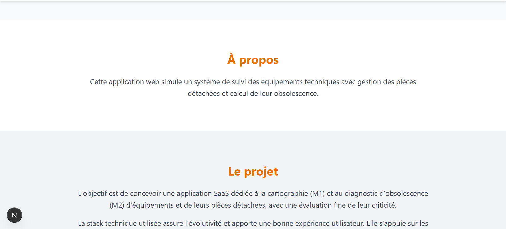

# Phase 3 – Gestion d’équipements (Next.js + TypeScript + Tailwind CSS)

Ce projet est une mini-application développée avec **Next.js**, **TypeScript** et **Tailwind CSS**. Dans le cadre de la troisième phase de recrutement pour GreenSpace

Réalisé par Mathis HEDER

##  Fonctionnalités

-  Redirection automatique de `/` vers `/main`
-  Affichage de la liste des équipements
-  Détail de chaque équipement avec :
    - Score d’obsolescence
    - Liste des pièces détachées
    - Dashboard 

## Score d’obsolescence

Le score est calculé en fonction de l’état des pièces :
- Pièce en stock : +10
- Pièce indisponible : +50
- Pièce obsolète : +90

## Ce qu'il reste à faire 
Pour compléter le projet il manque :
 - Intégrer une fonctionnalité de recherche active dans le dahsboard✅
 - Animer les differentes sections du site✅
 - Créer, structurer la base de données✅
 - Réaliser l'API avec fastAPI✅
 - Relier le front-end avec le backend✅
 - Faire des tests ✅ ??
 - Réaliser un responsive plus poussé pour que les utilisateurs mobiles puissent également utiliser✅
 - Ajouter la possibilité de créer des fiches ✅
 - Rendre les liens du header clickable ✅
 

## Des exemples d'amélioration
Système de pagination pour faciliter la navigation entre les équipements.

Filtrage et recherche (par nom, catégorie, état, score d’obsolescence).

Gestion des images pour chaque équipement (upload et affichage).

Export des données (CSV, Excel ou PDF).

Authentification et gestion des rôles pour sécuriser l’accès aux fonctionnalités.

Interface responsive améliorée pour une meilleure expérience sur mobile et tablette.

Tests unitaires et d’intégration dans l’application.

##  Lancer le projet

Ouvrir le dossier 'frontend' et creer un fichier nommé '.env.local'. Insérez y ces deux variables :

    NEXT_PUBLIC_API_URL=http://localhost:8000

    NEXT_PUBLIC_BASE_URL = http://localhost:3000

Puis dans un terminal, exécuter :
- cd ./frontend
- npm install
- npm run dev

Dans un autre terminal, exécuter :
- pip install "fastapi[standard]"
- pip install "uvicorn[standard]" 
- cd ./backend/app
- uvicorn main:app --reload

# Le rendu final

## Voici la page d'accueil qui permet de faire une mise en situation pour l'application

## Voici les sections "à propos" et "Le projet"

## Voici la page principale de l'application

On y voit la liste d'équipements ainsi que le menu qui permet d'accéder aux différentes composantes de l'application

## Voici la page d'un équipement

lorsque l'on clique sur un équipement, la liste des pièces qui le compose est chargé. 

## Voici la page "Ajouter un équipement"

## Voici la page "Ajouter une piece"

